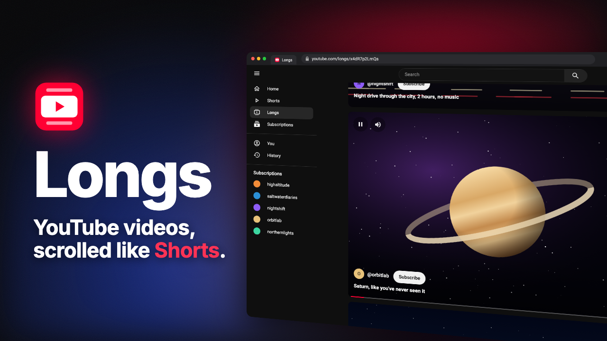

# Longs

**YouTube videos, scrolled like Shorts.**

Your YouTube recommendations, one full video at a time. Scroll, swipe or press ↓ for the next one.

&nbsp;

Chrome Web Store coming soon · <a href="https://github.com/ethembeldagli/yt-longs/releases">All releases</a>

## What it does

- **A Shorts-style feed for normal videos.** Your Home recommendations play one at a time, centred, with the end of the previous video above and the start of the next one below.
- **Scroll, swipe or press ↓** to move to the next video. More recommendations load as you go.
- **Like, subscribe and read comments** without leaving the feed.
- **YouTube's own settings**: subtitles, audio tracks (other languages), quality and playback speed.
- **Hover the timeline** to preview ahead.
- **Full screen that keeps scrolling.**
- **Every video gets its own link** at `youtube.com/longs/<video id>`. Back takes you out of Longs to the page you came from.

It uses YouTube's real player, so Premium (no ads), watch history, your quality settings and captions all work as usual.

## Install

| Browser | Where |
| --- | --- |
| Firefox | [Firefox Add-ons](https://addons.mozilla.org/firefox/addon/longs-for-youtube/) |
| Chrome | [Download the ZIP](https://github.com/ethembeldagli/yt-longs/releases/latest/download/yt-longs-chrome.zip) and install it as below. Chrome Web Store coming soon. |

### From this repo (Chrome, Brave and other Chromium browsers)

1. Download [`yt-longs-chrome.zip`](https://github.com/ethembeldagli/yt-longs/releases/latest/download/yt-longs-chrome.zip) and unzip it (or `git clone` this repo).
2. Open `chrome://extensions`.
3. Turn on **Developer mode**.
4. Click **Load unpacked** and choose the folder.
5. Refresh any open YouTube tabs.

### From this repo (Firefox 140 or later)

1. Download this repo and unzip it.
2. Open `about:debugging#/runtime/this-firefox`.
3. Click **Load Temporary Add-on…** and choose `firefox/manifest.json`.

Temporary add-ons are removed when Firefox restarts; install from Firefox Add-ons to keep it.

## Use it

- Click **Longs** in YouTube's sidebar, right under **Shorts**.
- Or click the toolbar button, press **Alt+Shift+L**, or go to [youtube.com/longs](https://www.youtube.com/longs).

| Key | Action |
| --- | --- |
| ↓ / ↑ (or Page Down / Page Up) | Next / previous video |
| Space or K | Play / pause |
| ← / → | Back / forward 5 seconds |
| J / L | Back / forward 10 seconds |
| M | Mute |
| C | Subtitles on / off |
| F | Full screen |
| Esc | Close Longs and stay on the video's normal page |

## Privacy

Longs runs entirely in your browser on youtube.com. It doesn't collect, send or store anything about you, and it has no servers. The only thing it saves is your Auto-scroll setting, in your browser.

**Permissions it asks for:**

| Permission | Why |
| --- | --- |
| Access to youtube.com | To add the Longs feed to YouTube |
| Storage | To remember your Auto-scroll setting |
| Scripting | To start Longs in YouTube tabs that were already open when you installed it |
| Declarative Net Request | To open `youtube.com/longs/…` links in Longs |

## Development

The main source is `manifest.json` and `src/`; that's the Chrome version.

- `node scripts/build-firefox.mjs` regenerates the `firefox/` folder from it. Don't edit `firefox/` by hand.
- `node scripts/package.mjs` builds both and makes the store uploads: `dist/yt-longs-chrome.zip` (Chrome Web Store, and the Chrome download in releases) and `dist/yt-longs-firefox.zip` (Firefox Add-ons).

## Licence

[MIT](LICENSE) © Ethem Beldagli

---

Longs is an independent project and isn't affiliated with or endorsed by YouTube or Google.
